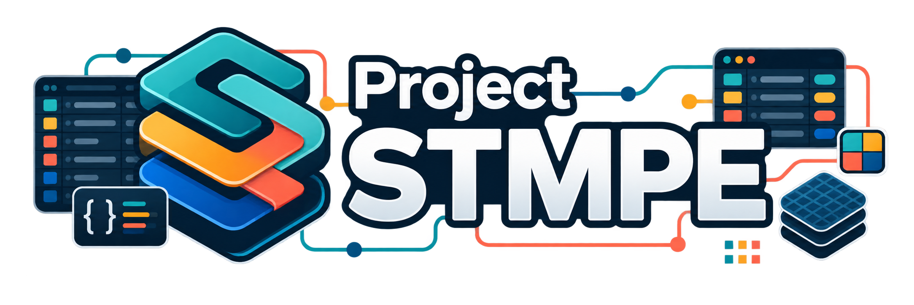

<p align="center">
  
</p>

<h1 align="center">Project STMPE</h1>

<p align="center"><em>A shared styling system that brings a family of sites into one consistent visual language.</em></p>

<p align="center">
  
  
  
  
  
</p>

---

## Overview

Project STMPE is the master archive for a shared styling system. The aim is a single
design language across a family of sites — per-site colourways, clean typography,
modern spacing, and optional companion userscripts where deeper page enhancements
need more than CSS.

Stylesheets and userscripts are published through GitLab Pages for direct
installation.

## Design direction

- Shared dark-theme foundations.
- Per-site accent colours over a common base.
- Consistent typography and spacing.
- Clean navigation, tables, panels, forms and metadata blocks.
- Optional userscripts for what CSS alone cannot do.

## Repository layout

Every theme package uses the same stylesheet entry point:

```text
Project-STMPE.css
```

Most packages are deliberately simple — one folder, one entry-point stylesheet.
A few carry extra local support assets, and one pairs its theme with richer
userscript functionality and its own assets.

## Userscript features

- **Sonarr integration** — multi-server config, connection testing, quality profile
  and root folder selection, colour-coded status links.
- **Fanart.tv clear logos** on detail pages.
- **IMDb Parents Guide** cards with severity colours, vote bars, spoiler blur, UK
  certificate badges and caching.
- **Homepage TMDb row** — trending, popular, top-rated, airing or on-air.
- **Artwork placeholders** for missing posters, banners and fan art.
- **Empty request-section hiding.**
- **Old-season collapse** with working expand controls.
- **Fixed trailer player** using a themed modal with a TMDb fallback lookup.
- **TMDb cast row** with photos and character names.
- **Actor showcase** cards with repaired images and known-for credits.
- **Enhanced summary** with rating, status, network, run years, episode data,
  stills and a next-episode countdown.
- **Stamps row repositioning.**
- **Fan-art carousel** controls for backgrounds and banners.
- **Collapsible news blocks.**

## Install

Use a profile stylesheet setting or a userstyle manager such as
[Stylus](https://add0n.com/stylus.html) with the published Pages URL for the
package you want.

For the enriched userscripts, use [Tampermonkey](https://www.tampermonkey.net/) or
[Violentmonkey](https://violentmonkey.github.io/).

## API keys

Some enriched features need your own keys or local service details — TMDb,
Fanart.tv or Sonarr. These live in browser storage or the script's settings panel
and are **not** stored in this repository.

## Status

This is the master backup and organisation repository. Individual packages can be
split out, published or cleaned up from here without losing the current working
state.

## Licence

Released under the [MIT Licence](LICENSE).
